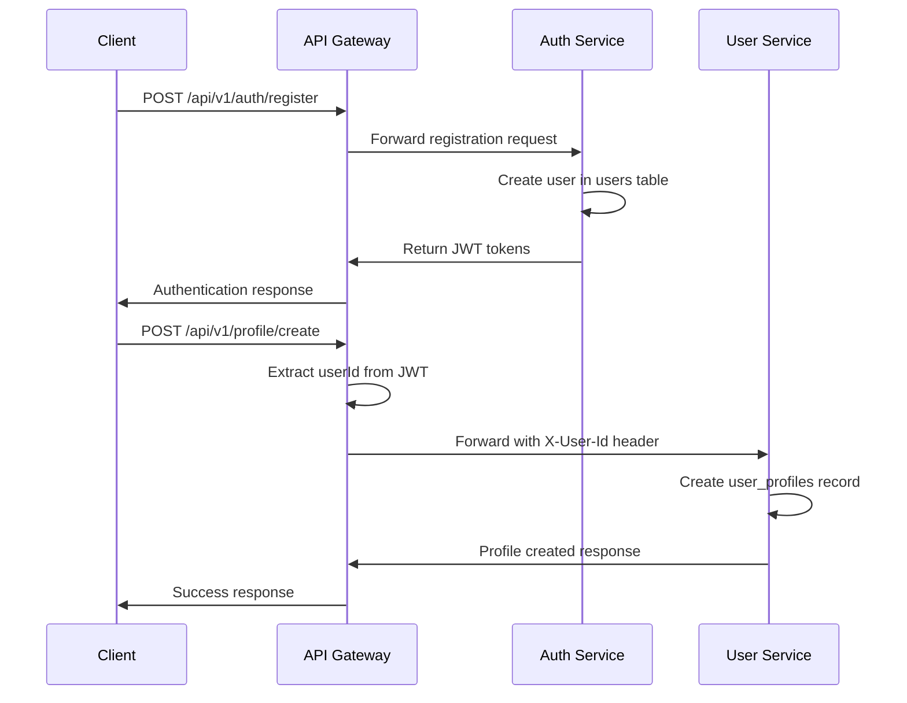
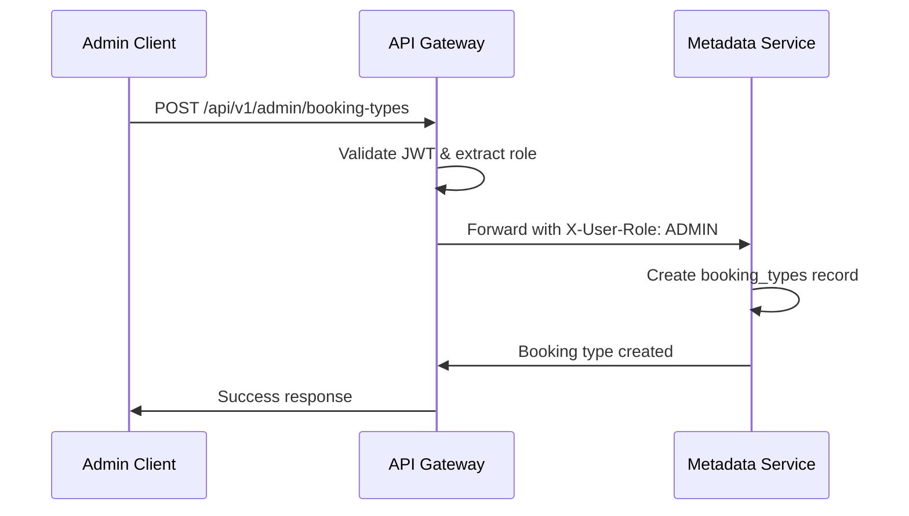
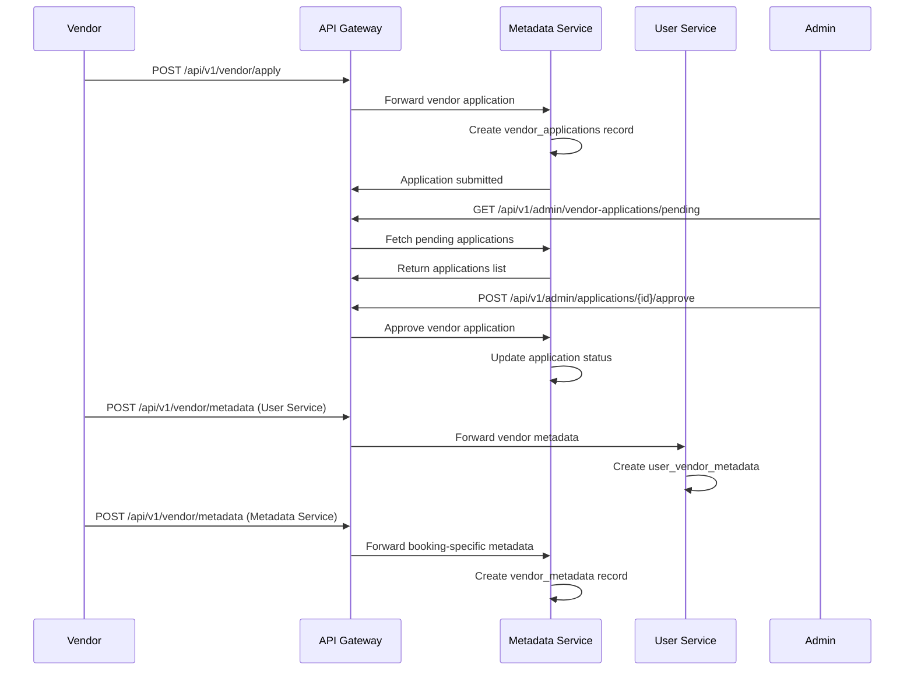
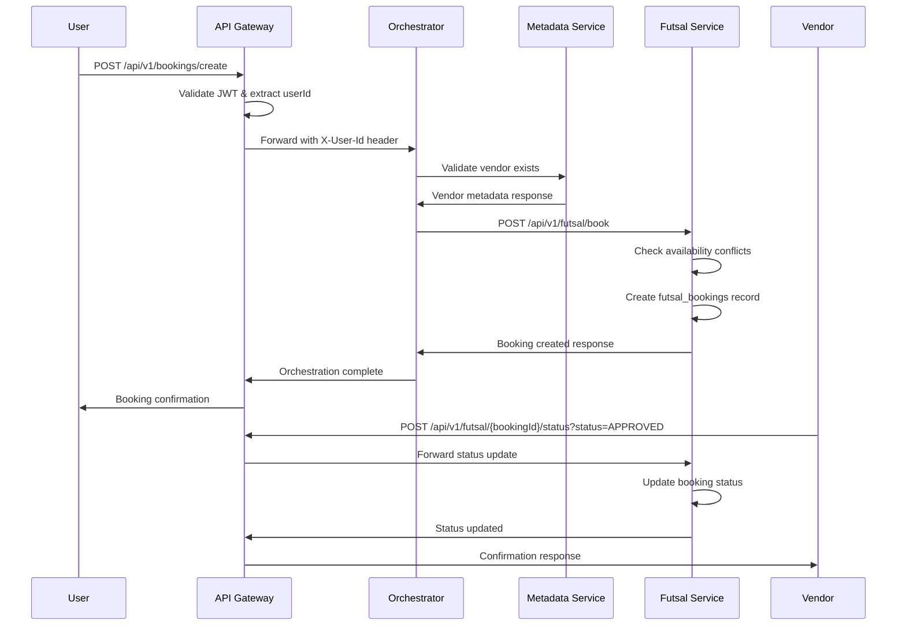

# Bookthething Microservices Architecture Workflow

**System Overview:** A distributed booking platform following microservices principles for scalable, maintainable service management across multiple booking domains (futsal, conference rooms, events).

---

## 🏗️ Core Microservices Architecture Principles

### 1. **Single Responsibility Principle**
Each service owns a specific business domain:

- **Auth Service**: User authentication, JWT token management, role-based access
- **User Service**: User profiles, vendor service metadata management  
- **Metadata Service**: Booking types, vendor applications, admin functions
- **Futsal Service**: Domain-specific booking logic for sports facilities
- **Booking Orchestrator**: Cross-service coordination and business process orchestration
- **API Gateway**: Request routing, authentication, service discovery

### 2. **Loose Coupling & High Cohesion**
- Services communicate via REST APIs with standardized JSON payloads
- No direct database access between services
- Each service can be developed, deployed, and scaled independently
- Business logic is cohesively contained within domain boundaries

### 3. **Database per Service**
- **Shared Database Pattern**: All services use PostgreSQL `bookingdb` but own separate tables
- **Data Ownership**: Each service manages its own entity lifecycle
- **Referential Integrity**: Handled at application layer using foreign key IDs

---

## 🔄 Complete Workflow Architecture

### **Phase 1: User Onboarding & Authentication**



**Microservices Principles Applied:**
- ✅ **Separation of Concerns**: Auth handles security, User Service handles profiles
- ✅ **API-First**: RESTful interfaces with clear contracts
- ✅ **Stateless**: JWT tokens eliminate session management dependencies

### **Phase 2: Admin Setup & Booking Type Management**



**Microservices Principles Applied:**
- ✅ **Role-Based Access Control**: Gateway enforces authorization
- ✅ **Domain-Driven Design**: Metadata service owns booking type lifecycle
- ✅ **Configuration Management**: Centralized booking type definitions

### **Phase 3: Vendor Onboarding Process**



**Microservices Principles Applied:**
- ✅ **Workflow Orchestration**: Multi-step business process spanning services
- ✅ **Event-Driven Architecture**: Application status changes trigger downstream actions
- ✅ **Data Consistency**: Each service maintains its own vendor metadata perspective

### **Phase 4: Booking Creation & Management (Core Business Logic)**



**Microservices Principles Applied:**
- ✅ **Service Orchestration**: Orchestrator coordinates complex business logic
- ✅ **Domain Isolation**: Futsal service handles sports-specific booking rules
- ✅ **Transactional Boundaries**: Each service manages its own data consistency
- ✅ **Fault Tolerance**: Services can fail independently without affecting others

---

## 🏛️ Architecture Patterns Implementation

### **1. API Gateway Pattern**
```yaml
API Gateway (Port 8080):
  Responsibilities:
    - JWT Token Validation
    - Request Routing to Services
    - Header Injection (X-User-Id, X-User-Role)
    - Cross-Origin Resource Sharing (CORS)
    - Load Balancing & Service Discovery
  
  Benefits:
    - Single Entry Point for Clients
    - Centralized Authentication/Authorization
    - Protocol Translation & Rate Limiting
    - Service Abstraction from Clients
```

### **2. Database per Service (Modified)**
```yaml
Shared Database Strategy:
  Database: PostgreSQL (bookingdb)
  
  Service Data Ownership:
    Auth Service:
      - users (id, username, password, role)
      - refresh_token (user_id FK)
    
    User Service:
      - user_profiles (user_id FK)
      - user_vendor_metadata (vendor_id FK)
    
    Metadata Service:
      - booking_types (id, name, category)
      - vendor_applications (vendor_id, booking_type_id FK)
      - vendor_metadata (vendor_id, booking_type_id FK)
    
    Futsal Service:
      - futsal_bookings (user_id, vendor_id FK)
  
  Benefits:
    - Simplified Deployment & Operations
    - ACID Transactions Within Service Boundaries  
    - Reduced Network Latency
    - Easier Development Environment Setup
```

### **3. Service Orchestration Pattern**
```yaml
Booking Orchestrator Service:
  Type: Orchestrator (not Choreography)
  
  Responsibilities:
    - Business Process Coordination
    - Service-to-Service Communication
    - Data Transformation Between Services
    - Error Handling & Compensation Logic
  
  Communication Pattern:
    - Synchronous REST API calls
    - Request/Response with timeout handling
    - Circuit Breaker pattern implementation
```

### **4. Domain-Driven Design (DDD)**
```yaml
Domain Boundaries:
  
  Identity & Access Domain:
    - Service: Auth Service
    - Entities: User, RefreshToken
    - Use Cases: Registration, Login, Token Refresh
  
  User Management Domain:
    - Service: User Service  
    - Entities: UserProfile, VendorMetadata
    - Use Cases: Profile Management, Vendor Services
  
  Booking Platform Domain:
    - Service: Metadata Service
    - Entities: BookingType, VendorApplication
    - Use Cases: Platform Configuration, Vendor Onboarding
  
  Sports Booking Domain:
    - Service: Futsal Service
    - Entities: FutsalBooking, BookingStatus
    - Use Cases: Court Booking, Availability Management
  
  Business Process Domain:
    - Service: Booking Orchestrator
    - Use Cases: Cross-Domain Workflows
```

---

## 🚀 Microservices Benefits Realized

### **1. Independent Deployability**
- Each service has its own Maven build lifecycle
- Services can be updated without affecting others
- Rolling deployments possible per service
- Different technology stacks possible (all currently Spring Boot)

### **2. Scalability & Performance**
```yaml
Scaling Strategy:
  High Traffic Services:
    - Futsal Service: Multiple instances for booking load
    - API Gateway: Load balancer for request distribution
  
  Resource Optimization:
    - Auth Service: CPU-optimized for JWT operations
    - Metadata Service: Memory-optimized for configuration data
    - User Service: Storage-optimized for profile data
```

### **3. Technology Diversity**
```yaml
Current Stack Consistency:
  - Framework: Spring Boot 3.x/4.x
  - Database: PostgreSQL 17
  - Authentication: JWT with HMAC256
  - API Documentation: REST with OpenAPI potential
  
Future Technology Options:
  - Message Queues: RabbitMQ/Apache Kafka for async processing
  - Caching: Redis for session/metadata caching
  - Service Mesh: Istio for advanced traffic management
```

### **4. Fault Isolation**
- Auth Service failure → Users can't login but existing sessions work
- Metadata Service failure → New bookings fail but existing bookings continue  
- Futsal Service failure → Only sports bookings affected, other domains work
- Orchestrator failure → Direct service calls still possible

---

## 🔧 Service Communication Patterns

### **Synchronous Communication (Current)**
```yaml
Pattern: Request/Response over HTTP/REST
Use Cases:
  - Real-time booking creation
  - User authentication flows
  - Immediate data validation

Advantages:
  - Simple implementation
  - Strong consistency
  - Easy debugging and monitoring

Trade-offs:
  - Service coupling through network calls
  - Cascading failure potential
  - Latency accumulation
```

### **Data Consistency Strategy**
```yaml
Consistency Level: Eventual Consistency

Implementation:
  - Each service manages its own transactions
  - Foreign key relationships via application logic
  - No distributed transactions (2PC avoided)
  - Compensation patterns in orchestrator

Examples:
  - User creation → Profile creation (eventual)
  - Vendor approval → Metadata activation (eventual)
  - Booking creation → Notification sending (eventual)
```

---

## 📊 Monitoring & Observability

### **Health Check Strategy**
```yaml
Service Health Endpoints:
  - Auth Service: /actuator/health
  - User Service: /actuator/health  
  - Metadata Service: /actuator/health
  - Futsal Service: /actuator/health
  - Orchestrator: /api/v1/bookings/health
  - Gateway: /actuator/health

Monitoring Approach:
  - Spring Boot Actuator for metrics
  - Database connection health checks
  - Custom business logic health indicators
```

### **Logging & Tracing**
```yaml
Distributed Tracing Strategy:
  - Correlation ID injection at Gateway
  - Service-to-service call tracking
  - Request/response logging with headers
  - Error propagation with context

Log Aggregation:
  - Structured logging (JSON format)
  - Centralized log collection potential
  - Business event logging for audit trails
```

---

## 🎯 Business Value & Technical Excellence

### **Business Benefits**
1. **Faster Time to Market**: Independent service development teams
2. **Domain Expertise**: Each team specializes in specific business area
3. **Scalable Growth**: New booking types = new services without monolith changes
4. **Risk Mitigation**: Service failures don't bring down entire platform

### **Technical Excellence**
1. **Clean Architecture**: Clear separation of concerns and dependencies
2. **Testability**: Each service can be unit/integration tested independently  
3. **Maintainability**: Smaller, focused codebases easier to understand
4. **Security**: Fine-grained access control and attack surface isolation

### **Microservices Maturity Assessment**

| Principle | Implementation Level | Evidence |
|-----------|---------------------|----------|
| **Single Responsibility** | ✅ Mature | Each service has clear business domain |
| **Autonomous Teams** | 🔶 Developing | Shared database requires coordination |
| **Decentralized Data** | 🔶 Partial | Logical separation, physical shared DB |
| **Infrastructure Automation** | 🔶 Basic | Manual deployment, Docker ready |
| **Design for Failure** | 🔶 Basic | Health checks, no circuit breakers yet |
| **Evolutionary Architecture** | ✅ Good | Clean API contracts, extensible design |

---

## 🔮 Future Architecture Evolution

### **Phase 1: Enhanced Resilience**
- Implement Circuit Breaker pattern in Orchestrator
- Add retry mechanisms with exponential backoff
- Introduce async messaging for non-critical operations

### **Phase 2: Data Architecture**
- Migrate to true database-per-service
- Implement event sourcing for audit requirements
- Add data synchronization mechanisms

### **Phase 3: Cloud Native**
- Kubernetes deployment with service mesh
- Auto-scaling based on business metrics
- Multi-region deployment for high availability

**Current State**: **Functional Microservices** with room for operational maturity enhancements.

**Architecture Success**: ✅ The system successfully demonstrates microservices principles while maintaining operational simplicity and development velocity.