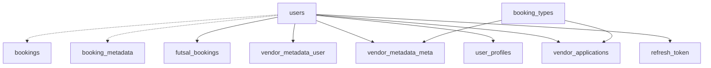

# Database Details - Bookthething Microservices

**Analysis Date:** November 29, 2025  
**Database:** PostgreSQL (bookingdb)  
**Schema:** All services use the same shared database with different table ownership

---

## 🏗️ Service Architecture & Port Configuration

| Service | Port | Database Access | Purpose |
|---------|------|----------------|---------|
| **API Gateway** | 8080 | ❌ No DB | Request routing, JWT validation |
| **Auth Service** | 8081 | ✅ PostgreSQL | User authentication, tokens |
| **User Service** | 8083 | ✅ PostgreSQL | User profiles, vendor metadata |
| **Metadata Service** | 8084 | ✅ PostgreSQL | Booking types, vendor applications |
| **Booking Orchestrator** | 8086 | ✅ PostgreSQL | Business logic (no entities) |
| **Futsal Service** | 8087 | ✅ PostgreSQL | Futsal bookings |

---

## 📊 Database Schema Analysis

### Auth Service (Port 8081)
**DDL Mode:** `update`

#### Table: `users`
| Column | Type | Constraints | Purpose |
|--------|------|-------------|---------|
| id | BIGINT | PK, AUTO_INCREMENT | Primary identifier |
| username | VARCHAR(255) | NOT NULL, UNIQUE | Login username |
| password | VARCHAR(255) | NOT NULL | Encrypted password |
| role | VARCHAR(255) | ENUM | USER/VENDOR/ADMIN |
| is_vendor | BOOLEAN | DEFAULT false | Vendor flag |
| is_admin | BOOLEAN | DEFAULT false | Admin flag |

#### Table: `refresh_token`
| Column | Type | Constraints | Purpose |
|--------|------|-------------|---------|
| id | BIGINT | PK, AUTO_INCREMENT | Token identifier |
| user_id | BIGINT | NOT NULL | **FK → users.id** |
| token_hash | VARCHAR(255) | | Hashed token value |
| issued_at | TIMESTAMP | | Token creation time |
| expires_at | TIMESTAMP | | Token expiry time |
| revoked | BOOLEAN | DEFAULT false | Revocation status |
| client_info | VARCHAR(255) | | Client metadata |

---

### User Service (Port 8083)  
**DDL Mode:** `update`

#### Table: `user_profiles`
| Column | Type | Constraints | Purpose |
|--------|------|-------------|---------|
| id | BIGINT | PK, AUTO_INCREMENT | Profile identifier |
| user_id | BIGINT | NOT NULL | **FK → users.id** |
| username | VARCHAR(255) | NOT NULL | Username copy |
| email | VARCHAR(255) | NOT NULL | Email address |
| phone | VARCHAR(255) | | Phone number |
| address | VARCHAR(255) | | Physical address |

#### Table: `vendor_metadata` (User Service)
| Column | Type | Constraints | Purpose |
|--------|------|-------------|---------|
| id | BIGINT | PK, AUTO_INCREMENT | Metadata identifier |
| vendor_id | BIGINT | | **FK → users.id** |
| service_name | VARCHAR(255) | | Service type |
| location | VARCHAR(255) | | Service location |
| price | DOUBLE | | Service price |
| extra_info | TEXT | | Additional details |
| images | TEXT | | Image URLs |
| availability_window | TEXT | | Time windows |

---

### Metadata Service (Port 8084)
**DDL Mode:** `create-drop` ⚠️

#### Table: `booking_types`
| Column | Type | Constraints | Purpose |
|--------|------|-------------|---------|
| id | BIGINT | PK, AUTO_INCREMENT | Type identifier |
| name | VARCHAR(255) | NOT NULL, UNIQUE | Type name |
| description | TEXT | | Type description |
| category | VARCHAR(255) | | Service category |

#### Table: `vendor_metadata` (Metadata Service)
| Column | Type | Constraints | Purpose |
|--------|------|-------------|---------|
| id | BIGINT | PK, AUTO_INCREMENT | Metadata identifier |
| vendor_id | BIGINT | | **FK → users.id** |
| booking_type_id | BIGINT | | **FK → booking_types.id** |
| location | VARCHAR(255) | | Service location |
| price | DOUBLE | | Service price |
| availability_window | TEXT | | Time availability |
| extra_info | TEXT | | Additional details |
| images | TEXT | | Image URLs |

#### Table: `vendor_applications`
| Column | Type | Constraints | Purpose |
|--------|------|-------------|---------|
| id | BIGINT | PK, AUTO_INCREMENT | Application identifier |
| vendor_id | BIGINT | | **FK → users.id** |
| booking_type_id | BIGINT | | **FK → booking_types.id** |
| status | VARCHAR(255) | NOT NULL | PENDING/APPROVED/REJECTED |
| applied_at | TIMESTAMP | DEFAULT NOW() | Application time |
| details | TEXT | | Application details |

---

### Futsal Service (Port 8087)
**DDL Mode:** `update`

#### Table: `futsal_bookings`
| Column | Type | Constraints | Purpose |
|--------|------|-------------|---------|
| id | UUID | PK | Booking identifier |
| user_id | UUID | NOT NULL | **Converted from users.id** |
| vendor_id | UUID | NOT NULL | **Converted from users.id** |
| start_time | TIMESTAMP | NOT NULL | Booking start |
| end_time | TIMESTAMP | NOT NULL | Booking end |
| participants | INTEGER | NOT NULL | Number of players |
| status | VARCHAR(255) | NOT NULL | PENDING/APPROVED/REJECTED/CANCELLED |
| price | DOUBLE | NOT NULL | Booking cost |
| created_at | TIMESTAMP | NOT NULL | Creation time |

---

### Booking Orchestrator (Port 8086)
**DDL Mode:** `update`  
**Tables:** None (stateless service)

---

## 🔄 Data Flow Analysis

### Foreign Key Relationships



### ⚠️ Critical Issues Found

#### 1. **Duplicate vendor_metadata Tables**
- **User Service:** `vendor_metadata` (serviceName field)
- **Metadata Service:** `vendor_metadata` (bookingTypeId field)  
- **Problem:** Schema conflict, different purposes

#### 2. **Data Type Mismatches**
- **Auth/User Services:** Use `BIGINT` for IDs
- **Futsal Service:** Uses `UUID` for all IDs
- **Problem:** ForeignKey relationships broken

#### 3. **DDL Mode Inconsistency**
- **Metadata Service:** `create-drop` (data loss on restart)
- **Other Services:** `update` (persistent data)
- **Problem:** Metadata loss on service restart

#### 4. **Orphaned Tables**
- `booking_metadata` - Not mapped to any service
- `bookings` - Not mapped to any service  
- `user_profile` vs `user_profiles` - Naming inconsistency

#### 5. **Missing Relationships**
- No explicit FK constraints in database
- Services handle relationships via application logic
- No referential integrity enforcement

---

## 🚨 Recommendations

### Immediate Fixes
1. **Unify ID Types:** Convert all services to use consistent BIGINT IDs
2. **Resolve vendor_metadata Conflict:** Merge schemas or rename tables
3. **Fix DDL Mode:** Change metadata service to `update`
4. **Add FK Constraints:** Implement database-level referential integrity
5. **Clean Orphaned Tables:** Remove unmapped tables

### Service Communication Flow
```
User Request → Gateway:8080 → Orchestrator:8086 
    ↓
    ├── Auth:8081 (user validation)
    ├── Metadata:8084 (vendor validation)  
    └── Futsal:8087 (booking creation)
```

The orchestrator successfully coordinates the flow despite the schema inconsistencies by handling data type conversions in the application layer.

---

**Status:** ⚠️ **System Functional with Schema Issues**  
**Priority:** Fix data type mismatches and DDL inconsistencies for production readiness.